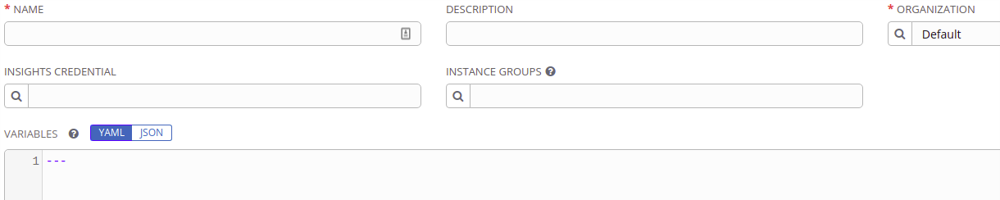
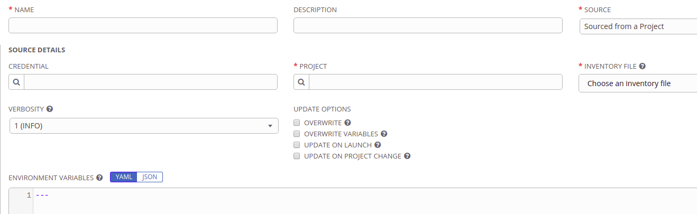
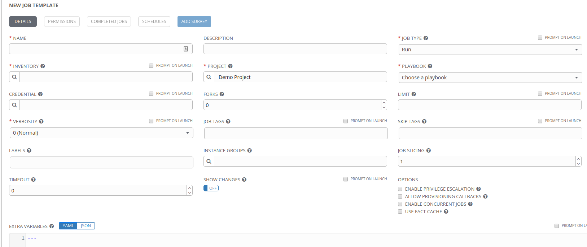

.. sectionauthor:: Chris Reynolds <creynold@redhat.com>
.. _docs admin: creynold@redhat.com

==================================================
Configuring Ansible Tower
==================================================

In this lab will you'll be working with Ansible Tower to make it how we interface with our playbooks, roles, and infrastructure for the rest of the workshop. We'll configure Tower with your inventory, credentials, and tell it how to interface with :github:`github.com<>` to manage playbooks and roles.

Your control node already has Tower deployed at \https://|control_public_ip|.


Ansible Tower License
---------------------

Request a license at https://www.ansible.com/workshop-license to use for this workshop.


Configuring Ansible Tower
--------------------------

There are a number of constructs in the Ansible Tower UI that enable multi-tenancy, notifications, scheduling, etc. Today we're going to focus on a few of the key constructs that are essential to any workflow.

-  Credentials
-  Projects
-  Inventory
-  Job Template

Let's start with adding a Credential.

Creating Credentials
``````````````````````

Credentials are utilized by Tower for authentication when launching Ansible jobs involving machines, synchronizing with inventory sources, and importing project content from a version control system.

There are many `types of credentials <http://docs.ansible.com/ansible-tower/latest/html/userguide/credentials.html#credential-types>`__ including machine, network, and various cloud providers. In this workshop, we'll create a *machine* credential.

- Select the key icon |Credentials button| on the left rail.
- Click ADD |Add button| on the right side.

Use this information to complete the credential form.

+------------------------+---------------------------------------+
| NAME                   | Ansible Workshop Credential           |
+========================+=======================================+
| DESCRIPTION            | Credentials for Ansible Workshop      |
+------------------------+---------------------------------------+
| ORGANIZATION           | Default                               |
+------------------------+---------------------------------------+
| TYPE                   | Machine                               |
+------------------------+---------------------------------------+
| USERNAME               | |student_name|                        |
+------------------------+---------------------------------------+
| PASSWORD               | |student_pass|                        |
+------------------------+---------------------------------------+
| PRIVILEGE ESCALATION   | Sudo (This is the default)            |
+------------------------+---------------------------------------+

.. figure:: ./_static/images/at_cred_detail.png
   :alt: Adding a Credential

   Adding a Credential

Click SAVE |Save button| to save each new Credential.

These credentials will allow us to configure the rest of Tower. Next, create a
Project that points back to your source code in Github.

Creating a Project
```````````````````

A Project is a logical collection of Ansible playbooks, represented in Tower. You can manage playbooks and playbook directories by either placing them manually under the Project Base Path on your Tower server, or by placing your playbooks into a source code management (SCM) system supported by Tower, including Git, Subversion, and Mercurial.

- Click on PROJECTS on the left rail
- Select ADD |Add button|

Complete the form using the following entries

================== ===================================================
NAME               Ansible Workshop Project
================== ===================================================
DESCRIPTION        workshop playbooks
ORGANIZATION       Default
SCM TYPE           Git
SCM URL            https://github.com/|student_name|/ansible-for-devops-workshop
SCM BRANCH
SCM UPDATE OPTIONS [x] Clean [x] Delete on Update [x] Update on Launch
================== ===================================================

.. figure:: ./_static/images/at_project_detail.png
   :alt: Defining a Project

   Defining a Project

Click SAVE |Save button| to save your project.

With your Github repository set up as a source of Ansibe code for your Tower
instance, next you'll add an Inventory that references the inventory file you've
been maintaining in Github today.

Creating an Inventory
``````````````````````

An inventory is a collection of hosts against which jobs may be launched. Inventories are divided into groups and these groups contain the actual hosts. Groups may be sourced manually, by entering host names into Tower, or from one of Ansible Tower’s supported cloud providers.
An Inventory can also be imported into Tower using the ``tower-manage`` command and this is how we are going to add an inventory for this workshop.

- Click on INVENTORIES
- Select ADD |Add button|
- Complete the form using the following entries

+----------------+------------------------------+
| NAME           | Ansible Workshop Inventory   |
+================+==============================+
| DESCRIPTION    | Ansible Inventory            |
+----------------+------------------------------+
| ORGANIZATION   | Default                      |
+----------------+------------------------------+



   Creating an Inventory

Click SAVE |Save button| to save your new inventory.

Next, click Sources |Source button| to add a source for your inventory.

Inventory Sources
~~~~~~~~~~~~~~~~~~~

Inventory sources can come from multiple locations including all of the public
and on-premise cloud and infrastructure providers, Red Hat Satellite, and even
custom scripts. For today's workshop, you'll add a source to your inventory that
references the file in your Github repository project. Fill in your inventory
source with the following information.

============ ===================================================================
NAME          Github Source
============ ===================================================================
DESCRIPTION   <leave blank>
CREDENTIAL    <leave blank>
SOURCE        Sourced from Project
OPTIONS       [x] Overwrite [x] Overwrite Variables [x] Update on Project Change
============ ===================================================================




Sync the Inventory
------------------

Select the Inventories icon on the left hand side.

From here select the ``Ansible Workshop Inventory`` that we just created.

Select the ``SOURCES`` button at the top and click the ``Start sync Process`` Icon under actions.  This will start the sync from Github to your Ansible Tower inventory.

Once that has finished you will see the groups and hosts that you created earlier in the workshop.

Ansible Tower is now configured with everything we need to continue building out our infrastructure-as-code environment in today's workshop!

Creating job templates
-----------------------

Ansible Tower Job Templates are where everything comes together to get work
done. Job Templates have many configurable options. These are equivalent to
everything available to Ansible on the command line.



Let's walk through the fields so you can begin to re-create the playbooks we've
run today.

Name and Description
  These provide friendly and unique identifiers for your Job Templates.

Job Type
  - Run - Run the selected job
  - Check - Equivalent to "dry run" mode on the command line

Inventory
  Select the inventory to use.

Project
  The Project to pull playbooks from.

Playbook
  Once a project is selected, Playbook is populated with all of the playbooks
  available to the user within that project.

Credential
  Credentials needed for the playbook to operate. These could include machine,
  vault, or any other valid credential for your playbook. If you need more than
  one, you can select multiple credentials of different types in this field.

Forks
  The default Ansible fork value is 5. This is the number of concurrent SSH
  sessions Ansible will create to execute a playbook.

Limit
  One or more patterns to limit the hosts to execute the Job Template against.
  These are typically group names and can be additive. For example:

  - `a:b` means "in group a or b"
  - `a:b&c` means "in group a or b and in group c"
  - `a:!b` means in group a and exclude group b

Verbosity
  The level of log verbosity that will be recorded in the Tower database.

Job Tags
  Specify tasks with these tags to be executed

Skip Tags
  Specify tasks with these tags to be skipped during execution

Labels
  Labels to apply to the Job Template. These labels can be used to search and
  filter database searches in busy Tower systems

Instance Groups
  In multi-node Tower deployments, Instance Groups are defined to provide
  logical node groups. These groups can be logical ('dev' and 'prod') or they
  can represent your infrastructure topology.

Job Slicing
  Ansible Tower can slice large jobs up, dispersing the work across multiple
  concurrently running instances of the Job Template

Timeout
  An optional timeout value for the job task

Show Changes
  Equivelant to the `--diff` option on the command line

There are also several checkbox options.

- Enable Privilege Escalation
- Allow Provisioning Callbacks
- Enable Concurrent Jobs
- Use Fact Cache

Benefits of Job Templates
``````````````````````````

The options available in a Job Template are equivalent to the options available
on the command line. In addition, all of the playbooks executed in Tower are
recorded and searchable in the Tower database. Job Templates are also available
through the Tower API. That means other services could call your Ansible
playbooks in more complex workflows.

Summary
--------

Ansible Tower is how Ansible is consumed at enterprise scale. It provides an
API, a database that is a single source of truth, and the ability to deploy in a
highly-available mesh across your entire infrastructure. For any team managing
production environments, Ansible Tower is a vital tool.


.. |Browse button| image:: ./_static/images/at_browse.png
.. |Submit button| image:: ./_static/images/at_submit.png
.. |Gear button| image:: ./_static/images/at_gear.png

.. |Save button| image:: ./_static/images/at_save.png

