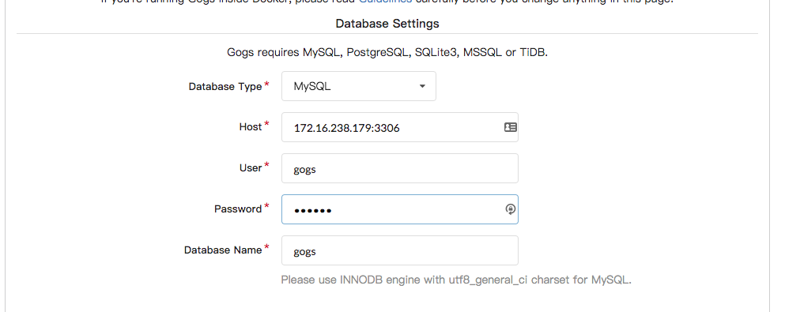
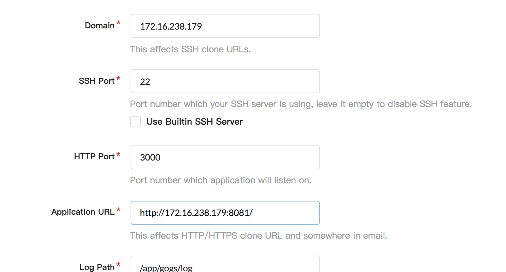
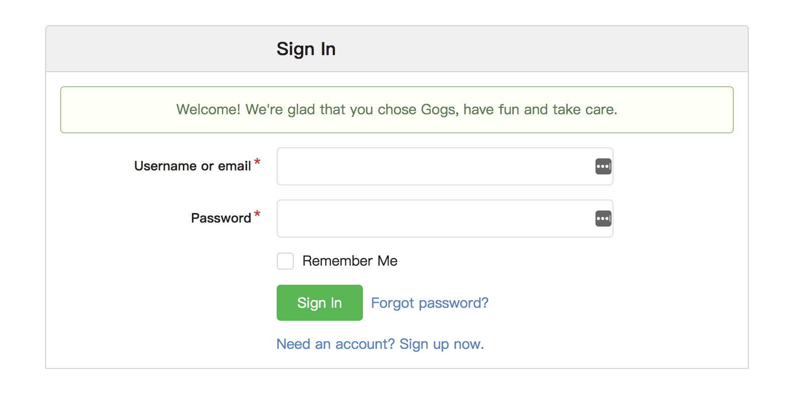
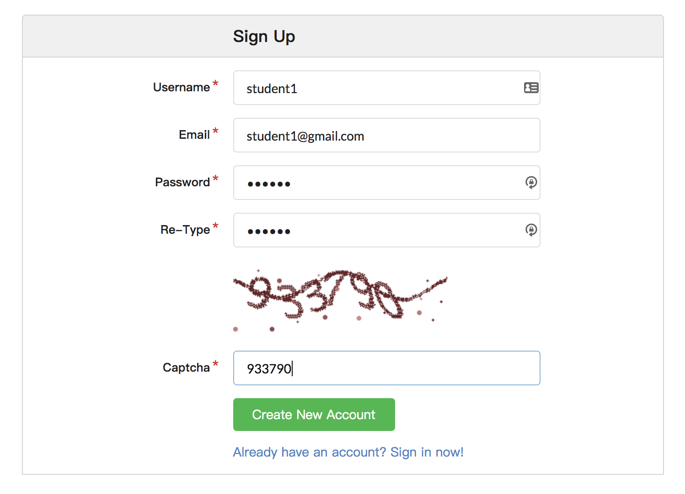
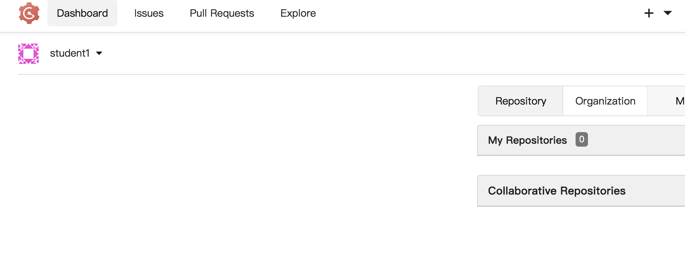

.. sectionauthor:: Jamie Duncan <jduncan@redhat.com>
.. _docs admin: jduncan@redhat.com

===========================
Setting up Version Control
===========================

Overview
`````````

In this lab you'll configure your control host to serve your playbooks and other content for the rest of today's lab. We'll be using `GOGS <https://gogs.io/>`__ deployed in a container for this. Our tasks for this lab are to:

1. Write a playbook to deploy GOGS on your control host
2. Deploy GOGS and confirm it's functioning properly

.. admonition:: Do I need to configure docker?!

  Your control host already has all the dependencies to run docker containers. That's because this lab guide is already running on your control host inside a container!

Let's get started.

Creating an initial inventory
``````````````````````````````

Ansible best practices include using inventory groups consistently. This makes your playbooks more portable. When your environment changes, only the inventory needs to be updated. Your roles and playbooks don't need to be edited.

.. admonition:: Why is this important?

  This allows content you create in this workshop to be used by simply using a different inventory.

Let's create your initial inventory with a ``gogs`` group. In your home directory, /home/|student_name|, create a directory named ``devops-workshop``.

.. code-block:: bash

  $ mkdir ~/devops-workshop
  $ cd devops-workshop

Next, in that directory, create a file named ``hosts`` with the following content:

.. parsed-literal::
  [gogs]
  |control_public_ip|

Next, we'll create an `ansible role <https://docs.ansible.com/ansible/latest/user_guide/playbooks_reuse_roles.html>`__ to apply to our GOGS group.

Creating a GOGS role
`````````````````````
Ansible roles should live in your playbook project inside a directory named ``roles``. Go ahead and create that directory.

.. code-block:: bash

  $ cd ~/devops-workshop
  $ mkdir roles
  $ cd roles

As we stated in the initial presentation, we're going to do our best to follow Ansible best practices in all of these labs. One of the key best practices is to use roles in (practically) every situation. Deploying GOGS will be no different. To create a role, we use the ``ansible-galaxy`` command.

.. code-block:: bash

  $ ansible-galaxy init gogs

This creates the prescriptive directory structure for your ansible role.

.. code-block:: bash

  $ ll gogs
  total 4
  drwxr-xr-x. 2 root root   22 Mar 16 06:52 defaults
  drwxr-xr-x. 2 root root    6 Mar 16 06:52 files
  drwxr-xr-x. 2 root root   22 Mar 16 06:52 handlers
  drwxr-xr-x. 2 root root   22 Mar 16 06:52 meta
  -rw-r--r--. 1 root root 1328 Mar 16 06:52 README.md
  drwxr-xr-x. 2 root root   22 Mar 16 06:52 tasks
  drwxr-xr-x. 2 root root    6 Mar 16 06:52 templates
  drwxr-xr-x. 2 root root   39 Mar 16 06:52 tests
  drwxr-xr-x. 2 root root   22 Mar 16 06:52 vars

This completes the basic infrastructure we'll need. Now, it's time to write some Ansible by creating our first role.

Creating GOGS role tasks
^^^^^^^^^^^^^^^^^^^^^^^^^

The tasks to deploy GOGS need to accomplish these tasks:

* Pull down a pre-defined GOGS container image
* Deploy the container on to the control host using the proper host port

In your GOGS role, add the following content to your ``tasks/main.yml`` file:

.. code-block:: yaml

  ---
  # tasks file for gogs
  - name: install docker-py requirements
    pip:
      name: docker-py
      state: present
      extra_args: --trusted-host pypi.org --trusted-host files.pythonhosted.org

  - name: pull the GOGS and MariaDB images
    docker_image:
      name: "{{ item }}"
      state: present
      with_items:
        - gogs/gogs
        - mariadb

  - name: start the GOGS container
    docker_container:
      name: gogs
      image: gogs/gogs
      ports:
        - "8081:3000"
        - "10022:22"
      restart_policy: always

  - name: start the MariaDB container
    docker_container:
      name: mariadb
      image: mariadb
      env:
        MYSQL_ROOT_PASSWORD: redhat
        MYSQL_DATABASE: gogs
      exposed_ports:
        - "3306"
      restart_policy: always


Writing your GOGS playbook
```````````````````````````

With your role in place, you're ready to deploy GOGS and MariaDB on your control node. To do this, your playbook will need to reference the role you just created. In your ``playbook`` directory, create a file named ``site.yml`` with the following contents.

.. code-block:: yaml

  - name: deploy GOGS
    gather_facts: false
    hosts: gogs
    roles:
      - gogs

As the workshop progresses, we'll continue building on this playbook to build out our complete environment. Next, we need to configure GOGS to connect to MariaDB so we can use it to house our source code.

Configuring GOGS
`````````````````

The GOGS UI is listening at |private_ip|:8081. The configuration is done using a web wizard. You'll need to configure a few options in this wizard to get going.

Connecting to MariaDB
^^^^^^^^^^^^^^^^^^^^^^

First, we'll tell GOGS how to connect to the MariaDB container. For this configuration, we'll use the IP address assigned to the MariaDB container by the container runtime. To find this IP address, we'll query the address directly. First we'll need the container ID for the MariaDB container

.. code-block::

  # docker ps | grep mariadb
4951ffc5110b        mariadb                                                          "docker-entrypoint..."   7 minutes ago       Up 7 minutes        3306/tcp                                        mariadb

In our example, the container ID is ``4951ffc5110b``.

With this information, we can query the container runtime to get it's IP address.

.. code-block::

  # docker inspect --format '{{ .NetworkSettings.IPAddress }}' 4951ffc5110b
  172.17.0.4

Our container's IP address is ``172.17.0.4``.



   Database connection options for GOGS

With this section complete, we'll wrap up the other configuration options.

Configuring GOGS URLs
^^^^^^^^^^^^^^^^^^^^^^^^^^^^

GOGS needs to know the URLs to use for cloning repositories and to host its application. Replace the instances of ``localhost`` in the *Domain* and *Application URL* fields with |private_ip|. Additionally, the port number for *Application URL* needs to be ``8081``.



This completes the GOGS configuration. Next, we'll register your user.

Setting up a GOGS user
```````````````````````

Once the configuration is complete you'll be forwarded to the GOGS login page. Click the *Sign up now.* link in the bottom of the UI square.



This takes you to the registration page. Use your student name, |student_name| for your login, and ``redhat`` for your password. Email is a required field, but we're not going to configure email notifications so any fake email address is fine. The final field is a Captcha field. Fill them out and click *Create New Account*.



You'll be returned to the login page. Log in with your |student_name| user with the password of ``redhat``. You'll see your dashboard page after logging in.



GOGS is now configured to house all of your repositories for the rest of the lab. Let's move on to the next lab where we'll configure our first load-balanced site.

.. admonition:: What if I need to reset?

  For this workshop, GOGS and MariaDB are not using persistent storage. That means if you stop these containers and restart them, you'll essentially be starting from scratch with configuring GOGS. This can be helpful, but be careful!
