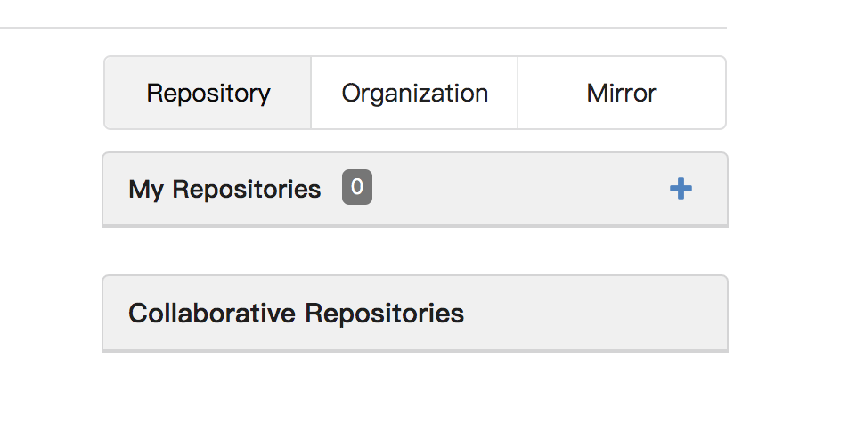
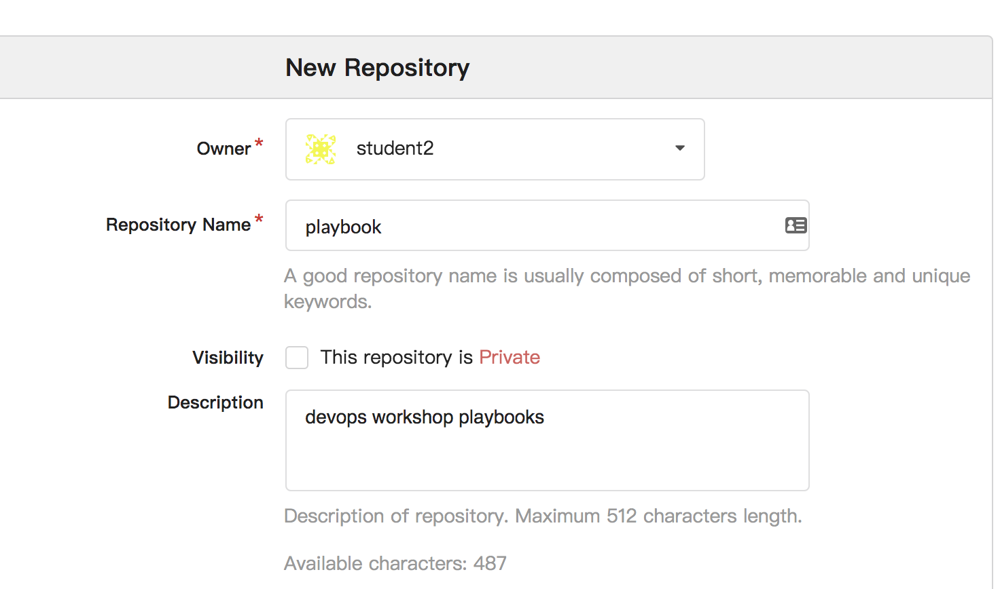
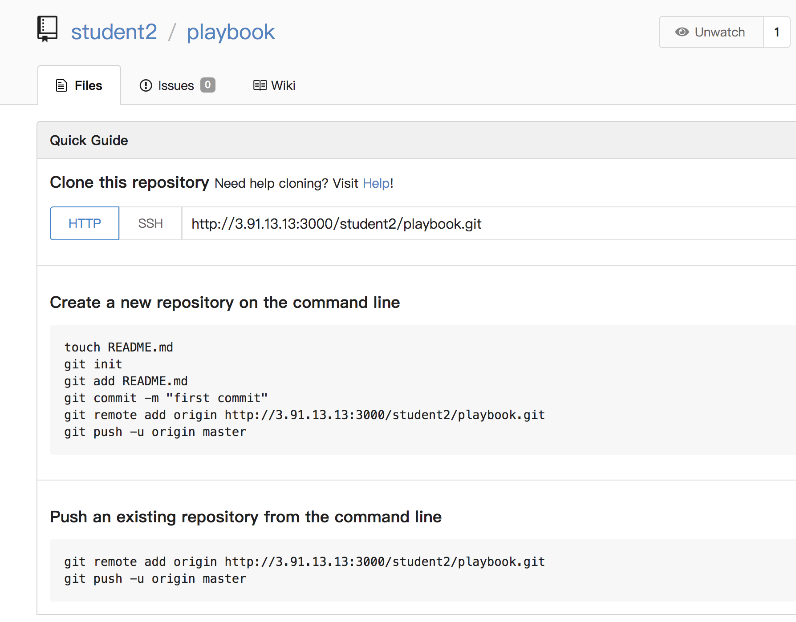
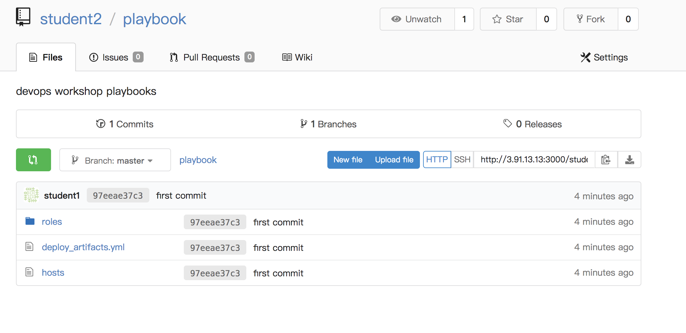

.. sectionauthor:: Jamie Duncan <jduncan@redhat.com>
.. _docs admin: jduncan@redhat.com

==========================================
Managing source code and container images
==========================================

Overview
`````````

In this lab we're using `GOGS <https://gogs.io/>`__ deployed in a container to provide version control for the playbooks and roles we'll create. Additionally we'll deploy a container registry to house our container images. Our tasks for this lab are to:

1. Write a playbook to deploy GOGS on your control host
2. Configure GOGS and confirm it's functioning properly
3. Deploy a container registry to manage container images

.. admonition:: Do I need to configure docker?!

  Your control host already has all the dependencies to run docker containers. That's because this lab guide is already running on your control host inside a container!

  Run ``docker ps`` on your control node to confirm.

Let's get started.

Adding inventory groups
``````````````````````````````

You need to add ``gogs`` and ``registry`` groups to your inventory located at ``~/playbook/hosts``.

.. code-block:: bash

  $ vim ~/playbook/hosts

Add your ``gogs`` and ``registry`` groups to ``~/playbook/hosts``.

.. parsed-literal::
  
  [nodes]
  |node_1_ip|
  |node_2_ip|
  |node_3_ip|
  |node_4_ip|

  [gogs]
  |control_public_ip|

  [registry]
  |control_public_ip|

Next, we'll create an `ansible role <https://docs.ansible.com/ansible/latest/user_guide/playbooks_reuse_roles.html>`__ to apply to our GOGS group.

Creating a GOGS role
`````````````````````
Ansible roles should live in your playbook project inside a directory named ``roles``. Go ahead and create that directory.

.. code-block:: bash

  $ mkdir ~/devops-workshop/roles
  $ cd roles

As we stated in the initial presentation, we're going to do our best to follow Ansible best practices in all of these labs. One of the key best practices is to use roles in (practically) every situation. Deploying GOGS will be no different. To create a role, we use the ``ansible-galaxy`` command.

.. code-block:: bash

  $ ansible-galaxy init gogs

This creates the prescriptive directory structure for your ansible role.

.. code-block:: bash

  $ tree gogs
  gogs
  ├── defaults
  │   └── main.yml
  ├── files
  ├── handlers
  │   └── main.yml
  ├── meta
  │   └── main.yml
  ├── README.md
  ├── tasks
  │   └── main.yml
  ├── templates
  ├── tests
  │   ├── inventory
  │   └── test.yml
  └── vars
      └── main.yml

This completes the basic infrastructure we'll need. Now, it's time to write some Ansible by creating our first role.

Creating GOGS role tasks
^^^^^^^^^^^^^^^^^^^^^^^^^

The tasks to deploy GOGS need to accomplish these tasks:

* Pull down a pre-defined GOGS container image
* Deploy the container on to the control host using the proper host port

In your GOGS role, add the following content to your ``tasks/main.yml`` file:

.. code-block:: yaml

  ---
  # tasks file for gogs
  - name: install docker-py requirements
    pip:
      name: docker-py
      state: present
      extra_args: --trusted-host pypi.org --trusted-host files.pythonhosted.org

  - name: pull the GOGS and MariaDB images
    docker_image:
      name: "{{ item }}"
      state: present
    loop:
      - gogs/gogs
      - mariadb

  - name: start the GOGS container
    docker_container:
      name: gogs
      image: gogs/gogs
      ports:
        - "8081:3000"
        - "10022:22"
      restart_policy: always

  - name: start the MariaDB container
    docker_container:
      name: mariadb
      image: mariadb
      env:
        MYSQL_ROOT_PASSWORD: redhat
        MYSQL_DATABASE: gogs
      exposed_ports:
        - "3306"
      restart_policy: always

Next, well create a role to manage our container registry deployment

Creating a registry role
`````````````````````````

You'll be deploying the `Docker v2 registry <https://hub.docker.com/_/registry>`__ on your control node and serving content on port 5000. To start, we'll create a new role inside ``~/devops-workshop/roles``, and use ``ansible-galaxy`` to start a role named ``registry``.

.. code-block:: shell

  $ cd ~/devops-workshop/roles
  $ ansible-galaxy init registry
  - registry was created successfully
  $ tree registry
  registry
  ├── defaults
  │   └── main.yml
  ├── files
  ├── handlers
  │   └── main.yml
  ├── meta
  │   └── main.yml
  ├── README.md
  ├── tasks
  │   └── main.yml
  ├── templates
  ├── tests
  │   ├── inventory
  │   └── test.yml
  └── vars
      └── main.yml

  8 directories, 8 files

In your new registry role, add the following content to ``tasks/main.yml``.

.. code-block:: yaml

  ---
  # tasks file for registry
  - name: pull the registry image
    docker_image:
      name: registry
      state: present

  - name: deploy the registry container
    docker_container:
      name: registry
      image: registry
      ports:
        - "5000:5000"
      restart_policy: always

Writing your artifact control playbook
````````````````````````````````````````

With your roles in place, you're ready to deploy GOGS, MariaDB, and the container registry on your control node. To do this, your playbook will need to reference the roles you just created. In your ``playbook`` directory, create a file named ``deploy_artifacts.yml`` with the following contents.

.. code-block:: yaml

  ---
  - name: deploy GOGS and MariaDB
    gather_facts: false
    become: yes
    hosts: gogs
    roles:
      - gogs

  - name: deploy container registry
    gather_facts: false
    become: yes
    hosts: registry
    roles:
      - registry

Once complete, run ``ansible-playbook`` referencing your inventory and the playbook you just created.

.. admonition:: Following best practices

  Like we said in the beginning, this playbook is designed to work regardless of how you have your hosts configured. Your ``gogs`` and ``registry`` groups use the same host in today's example, but the same playbooks works identically if the hosts are different. The only requirements are to be running docker and be in the proper groups in your inventory.

.. code-block:: bash

  $ cd ~/devops-workshop
  $ ansible-playbook -i hosts deploy_artifacts.yml -k
  SSH password:

  PLAY [deploy GOGS MariaDB and container registry] *****************************************************************

  TASK [gogs : install docker-py requirements] *****************************************************************
  ok: [3.91.13.13]

  TASK [gogs : pull the GOGS and MariaDB images] *****************************************************************
  changed: [3.91.13.13] => (item=gogs/gogs)
  changed: [3.91.13.13] => (item=mariadb)

  TASK [gogs : start the GOGS container] *****************************************************************
  changed: [3.91.13.13]

  TASK [gogs : start the MariaDB container] *****************************************************************
  changed: [3.91.13.13]

  TASK [registry : pull the registry image] *****************************************************************
  changed: [3.91.13.13]

  TASK [registry : deploy the registry container] *****************************************************************
  changed: [3.91.13.13]

  PLAY RECAP *****************************************************************
  3.91.13.13                 : ok=6    changed=5    unreachable=0    failed=0

Before we can use GOGS to house our source code, we need to configure it to connect to the MariaDB container.

Configuring GOGS
`````````````````

The GOGS UI is listening at |control_public_ip|:8081. The configuration is done using a web wizard. You'll need to configure a few options in this wizard to get going.

Connecting to MariaDB
``````````````````````

First, we'll tell GOGS how to connect to the MariaDB container. For this configuration, we'll use the IP address assigned to the MariaDB container by the container runtime. To find this IP address, we'll query the address directly. First we'll need the container ID for the MariaDB container

.. code-block:: bash

  $ sudo docker ps | grep mariadb
  4951ffc5110b        mariadb   "docker-entrypoint..."   7 minutes ago       Up 7 minutes        3306/tcp                                        mariadb

In our example, the container ID is ``4951ffc5110b``.

With this information, we can query the container runtime to get it's IP address.

.. code-block:: bash

  $ sudo docker inspect --format '{{ .NetworkSettings.IPAddress }}' 4951ffc5110b
  172.17.0.4

Our container's IP address is ``172.17.0.4``. Your root database user's password is ``redhat``. We set that in the task that deployed the container in the ``gogs`` Ansible role.

.. figure:: _static/images/gogs_config_1.png

   Database connection options for GOGS

With this section complete, we'll wrap up the other configuration options.

Configuring GOGS URLs
```````````````````````

GOGS needs to know the URLs to use for cloning repositories and to host its application. Replace the instances of ``localhost`` in the *Domain* and *Application URL* fields with |control_public_ip|. Additionally, the port number for *Application URL* needs to be ``8081``.

.. figure:: _static/images/gogs_config_2.png

This completes the GOGS configuration. Next, we'll register your user.

Setting up a GOGS user
```````````````````````

Once the configuration is complete you'll be forwarded to the GOGS login page. Click the *Sign up now.* link in the bottom of the UI square.

.. figure:: _static/images/gogs_login.png

This takes you to the registration page. Use your student name, |student_name| for your login, and ``redhat`` for your password. Email is a required field, but we're not going to configure email notifications so any fake email address is fine. The final field is a Captcha field. Fill them out and click *Create New Account*.

.. figure:: _static/images/gogs_register.png

You'll be returned to the login page. Log in with your |student_name| user with the password of ``redhat``. You'll see your dashboard page after logging in.

.. figure:: _static/images/gogs_dash.png

GOGS is now configured to house all of your repositories for the rest of the lab. Let's move on to the next lab where we'll configure our first load-balanced site. Our final task in deploying our CI/CD infrastructure is to create a repository in GOGS to hold the playbooks we just created.

.. admonition:: What if I need to reset?

  For this workshop, GOGS, MariaDB, and the container registry are not using persistent storage. That means if you stop these containers and restart them, you'll essentially be starting from scratch with configuring GOGS. This can be helpful, but be careful!

Creating a GOGS repository
---------------------------

To create our initial GOGS repository, we'll first create one in the GOGS UI, then add our content so far to it and upload to our remote host.

The first step is to create a new repository in the GOGS UI at \https://|control_public_ip|:8081. After logging in with |student_name| and |student_pass|, click |plus sign| on the right side of the screen.

Adding a new repository to GOGS
````````````````````````````````



  Adding a new repository in the GOGS UI

This takes you to the new repository wizard. We only need to fill out a name (``playbook``) and description for our repository.



  Filling in new repository information

After this is filled out, click |save button|. This will create your new repository and take you to its dashboard page.



  Playbook repository dashboard

With this complete, we'll take the ``playbook`` directory we've created and make it a git repository with our new repository set as the origin for it.

Creating a git repository from existing files
``````````````````````````````````````````````

On your control node, ``cd`` to your ``playbook`` directory

.. code-block:: bashs

  cd ~/playbook

From this directory, follow the directions from the GOGS repository dashboard. We'll make a few small changes in those instructions is to add all of the existing files instead of just the example ``README.md`` as well as to configure a username and email for your commit.

.. admonition:: What about README.md

  The ``README.md`` file is optional for this workshop, but is definitely a best practice in general.

.. parsed-literal::
  $ git init
  Initialized empty Git repository in /home/|student_name|/playbook/.git/
  $ git add .
  $ git config --global user.email "|student_name|@example.com"
  $ git config --global user.name |student_name|
  $ git commit -m "first commit"
  [master (root-commit) 97eeae3] first commit
   18 files changed, 280 insertions(+)
   create mode 100644 deploy_artifacts.yml
   create mode 100644 hosts
   create mode 100644 roles/gogs/README.md
   create mode 100644 roles/gogs/defaults/main.yml
   create mode 100644 roles/gogs/handlers/main.yml
   create mode 100644 roles/gogs/meta/main.yml
   create mode 100644 roles/gogs/tasks/main.yml
   create mode 100644 roles/gogs/tests/inventory
   create mode 100644 roles/gogs/tests/test.yml
   create mode 100644 roles/gogs/vars/main.yml
   create mode 100644 roles/registry/README.md
   create mode 100644 roles/registry/defaults/main.yml
   create mode 100644 roles/registry/handlers/main.yml
   create mode 100644 roles/registry/meta/main.yml
   create mode 100644 roles/registry/tasks/main.yml
   create mode 100644 roles/registry/tests/inventory
   create mode 100644 roles/registry/tests/test.yml
   create mode 100644 roles/registry/vars/main.yml
  $ git remote add origin \http://|control_public_ip|:8081/|student_name|/playbook.git
  $ git push -u origin master
  Counting objects: 31, done.
  Delta compression using up to 2 threads.
  Compressing objects: 100% (14/14), done.
  Writing objects: 100% (31/31), 3.82 KiB | 0 bytes/s, done.
  Total 31 (delta 1), reused 0 (delta 0)
  Username for 'http://3.91.13.13:8081': |student_name|
  Password for 'http://student2@3.91.13.13:8081':
  To http://3.91.13.13:8081/student2/playbook.git
   * [new branch]      master -> master
  Branch master set up to track remote branch master from origin.

You'll be prompted for your GOGS username and password you set up when you registered. And that's it. Your initial playbooks have been pushed into a git repository running in a container on your control node. To confirm your work was successful, reload your repository dashboard in GOGS and you should see the files that were just committed.



  GOGS repository dashboard after your first commit

With your initial Ansible content uploaded, you now have almost everything you need to create a full CI/CD pipeline for the rest of your workshop!

.. |plus sign| image:: _static/images/gogs_plus.png
.. |save button| image:: _static/images/gogs_save.png
