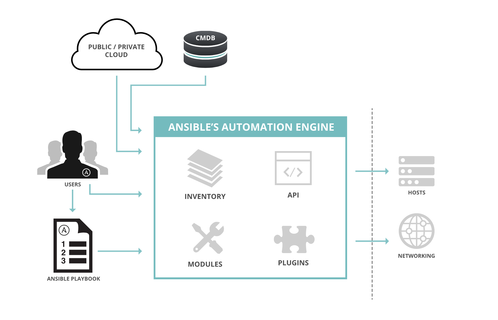
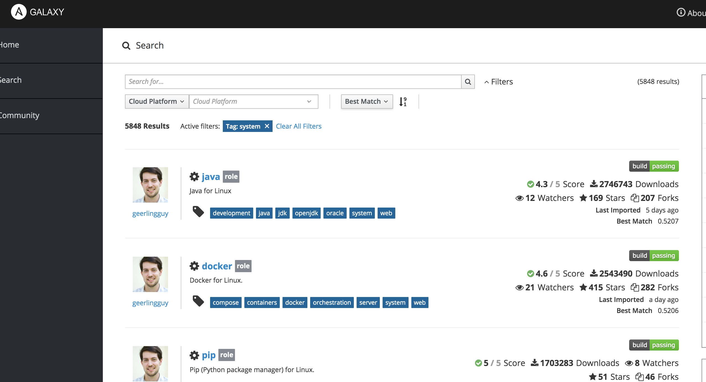

Lab 1 - Getting to know Ansible
================================

To start our lab today, we're going to spend a few minutes getting used to our environments while making sure everyone is comfortable with how Ansible works. This is more of a recap than an in-depth exploration. But it will cover the concepts that we'll be using today.

.. important::
  To begin, ``ssh`` to your Ansible host as your student user.

  .. parsed-literal::

    ssh |ssh_command|

  We'll use our control node for most of our exercises with Ansible, and some of our OpenShift-related exercises. Let's start with the simplest way to use Ansible; ad hoc commands.

  For a more in-depth look at the concepts around the Ansible language, engine, and Ansible Tower, please see the  `Ansible Essentials presentation </_static/ansible-essentials.html>`__.

Terms
------

Ansible
  Ansible is a language, written in `YAML <https://yaml.org/>`__, used to define the end state of (up to) your entire IT environment. It's the only language that can easily, natively handle 1) Linux 2) Windows 3) Networking 4) Security & Compliance 5) Application lifecycle automation in your infrastructure.

  - Linux systems connect using SSH and use Python.
  - Windows systems connect using WinRM and use PowerShell.
  - Networking systems connect using custom firmware interpreters over SSH

Ansible Engine
  Ansible engine is the tool that executes the Ansible language. It's written in Python, and is available for most Linux distributions.

Ansible Tower
  When you get to the point that you're managing large portions of your infrastructure, Ansible Tower is how you provide a single source of truth for your Ansible workflows. It integrates with cloud providers, virtualization platforms, CMDB and trouble ticketing systems, and pretty much anything with an API. Out of the box, it provides RBAC, mult-tenancy, a full RESTful API, and workflow tooling to make your infrastructure more manageable.

module
  An Ansible module is the basic unit of work. A module performs a single task. That task can be small, like creating a directory on a Linux server, or large, like creating an Azure guest instance. Multiple modules are run in order in a playbook.

playbook
  A playbook is a collection of tasks that use modules, an inventory group to run the tasks against, as well as all of the variables and templates needed to finish their work. Playbooks are how most Ansible is executed.



   High level Ansible architecture

Let's begin to put Ansible through its paces, beginning with *ad hoc commands*.

Ad hoc commands
----------------

.. important:: Which user to use?!

  Ansible uses SSH to connect to Linux systems. Your default inventory, ``/etc/ansible/hosts``, specifies a default user of ``ec2-user``. Instead of copying over our inventory and changing this parameter. Let's just switch to ``ec2-user`` for this lab.

  ``sudo su - ec2-user``

Ansible ad hoc commands use the ``ansible`` executable to run commands that use a single module against hosts in our inventory. As an initial task, lets run an ad hoc command that simply gives our server uptime. To run this command, you need to specify an inventory group to run against, a module to use (specified with the ``-m`` parameter) and any additional parameters that module may need. They also reference your inventory hosts. Let's take a look at how inventories are configured next.

Inventories
~~~~~~~~~~~~

Ansible inventories are the various hosts in your datacenter (Windows, Linux, Network) divided into various logical groups. They use `INI Standard <https://en.wikipedia.org/wiki/INI_file>`__, with groups being divided into INI groups with square brackets. On your control node, OpenShift was deployed using Ansible. Your OpenShift inventory is located at ``/etc/ansible/hosts``, the default location for Ansible inventories. We'll be working with the ``nodes`` group from this inventory.

.. code-block:: shell
  :emphasize-lines: 7,8,9,10,11

  [masters]
  ip-172-16-8-209.ec2.internal

  [etcd]
  ip-172-16-8-209.ec2.internal

  [nodes]
  ip-172-16-8-209.ec2.internal openshift_node_group_name="node-config-master"
  ip-172-16-81-65.ec2.internal openshift_node_group_name="node-config-infra"
  ip-172-16-15-55.ec2.internal openshift_node_group_name="node-config-compute"
  ip-172-16-230-235.ec2.internal openshift_node_group_name="node-config-compute"

  [glusterfs]
  ip-172-16-81-65.ec2.internal glusterfs_devices='["/dev/xvdb"]'
  ip-172-16-15-55.ec2.internal glusterfs_devices='["/dev/xvdb"]'
  ip-172-16-230-235.ec2.internal glusterfs_devices='["/dev/xvdb"]'

  # Create an OSEv3 group that contains the masters and nodes groups
  [OSEv3:children]
  masters
  nodes
  etcd
  glusterfs
  ...

Equipped with this information, let's run our first ad hoc commands. In this example we're running the ``command`` module to run the ``uptime`` command against the ``nodes`` group in our default inventory.

::

  $ ansible nodes -m command -a uptime

.. note::

  Ansible modules do their best to be *idempotent*. In the Ansible world, that term is used to describe how modules only make the changes they have to make so your desired end state is achieved.

  There are a few modules that can't be idempotent because of what they do. One of those is the ``command`` module. Because it executes any arbitrary command, there's no way it can ensure it will only make changes once. Other non-idempotent modules are `shell <https://docs.ansible.com/ansible/latest/modules/shell_module.html>`__, `raw <https://docs.ansible.com/ansible/latest/modules/raw_module.html>`__, and `script <https://docs.ansible.com/ansible/latest/modules/script_module.html>`__.

The ``command`` module only needs one parameter to function. But some modules need dozens of parameters to perform their assigned task.

Ad hoc commands can be useful if you need to quickly pull data from systems for analysis. But they're not how you should be interacting with Ansible at scale. That large-scale interaction and automation should happen with Ansible playbooks.

Playbooks
----------

Ansible playbooks are, in several ways, a long list of ad hoc commands. Playbooks also provide a more robust way to specify inventory hosts, define variables, and apply programmatic logic to your ad hoc commands. Every object in a playbook has a name, including the playbook itself. This is a fundamental best practice for Ansible. With some practice and experience, the output of your playbook runs effectively become the documentation for your IT infrastructure. Let's take a look at our

Here's a playbook to do the same thing we did previously with an ad hoc command. We'll expand this playbook througout the lab. Let's create a directory to save it in in our home directory.

.. code-block:: shell

  $ mkdir ~/playbooks
  $ cd ~/playbooks
  $ vim site.yml

You first playbook's contents should be like the example below.

.. code-block:: yaml

  ---
  - name: Our first playbook
    hosts: nodes

    tasks:
    - name: run the uptime command
      command: uptime

To execute the command, run the ``ansible-playbook`` command.

.. code-block:: shell

  $ ansible-playbook ~/playbooks/site.yml

Your output should look similar to

.. code-block:: shell

  $ ansible-playbook ~/playbooks/site.yml

  PLAY [Our first playbook] ******************************************************

  TASK [Gathering Facts] *********************************************************
  ok: [ip-172-16-230-235.ec2.internal]
  ok: [ip-172-16-15-55.ec2.internal]
  ok: [ip-172-16-8-209.ec2.internal]
  ok: [ip-172-16-81-65.ec2.internal]

  TASK [run the uptime command] **************************************************
  changed: [ip-172-16-8-209.ec2.internal]
  changed: [ip-172-16-81-65.ec2.internal]
  changed: [ip-172-16-15-55.ec2.internal]
  changed: [ip-172-16-230-235.ec2.internal]

  PLAY RECAP *********************************************************************
  ip-172-16-15-55.ec2.internal : ok=2    changed=1    unreachable=0    failed=0
  ip-172-16-230-235.ec2.internal : ok=2    changed=1    unreachable=0    failed=0
  ip-172-16-8-209.ec2.internal : ok=2    changed=1    unreachable=0    failed=0
  ip-172-16-81-65.ec2.internal : ok=2    changed=1    unreachable=0    failed=0

The command module doesn't require any parameters to run. Let's add another task to our playbook that does need parameters. Parameters are additional information you pass to an Ansible module so it has enough information to perform its task correctly.

Parameters
~~~~~~~~~~~

Let's restart the ``chronyd`` service on our nodes. To do this, we'll add a second task to our playbook. Use the ``service`` module to restart the ``chronyd`` service. It needs two parameters. First, ``name`` specifies the name of the service to work with. Second, ``state`` takes the following options:

- reloaded
- restarted
- started
- stopped

Every Ansible module is fully documented at http://docs.ansible.com. The docs focus on all parameters for each module and providing useful examples. Let's take a look at our next example.

.. code-block:: yaml

  ---
  - name: Our second playbook - with parameters
    hosts: nodes

    tasks:
    - name: run the uptime command
      command: uptime

    - name: restart chronyd
      service:
        name: chronyd
        state: restarted

Like before, run this playbook using ``ansible-playbook``.

.. code-block:: bash

  $ ansible-playbook ~/playbooks/site.yml

.. note::

  YAML is a whitespace-aware language. That means indentation is an important part of its structure. The best way to think of it is that if something is indented, it's owned by the last object on the previous level of indentation. Indentation implies ownership. Most modern editors and IDEs have the ability to show you levels of indentation as you go to make this a little easier.

  .. figure:: images/ops/ansible_indentation_view.png
     :alt: Atom IDE with indentation of YAML visualized
     :scale: 70%

     Atom IDE with indentation of YAML visualized

This playbook doesn't do a lot of meaningful work. The reason we're not configuring your cluster during this lab is because your OpenShift cluster is already configured. An OpenShift |openshift_ver| deployment takes ~45 minutes, and we don't want to start our day off with lunch. This is more an investigative lab. In that spirit, let's look at some of the more advanced things you can do inside an Ansible playbook.

Advanced Playbook Options
--------------------------

Ansible prides itself on incorporating `DRY principles <https://en.wikipedia.org/wiki/Don%27t_repeat_yourself>`__ into its best practices. That means a big part of creating Ansible playbooks revolves around making them useful under multiple conditions. This is done using some of the more advanced options available inside a playbook.

Variables
~~~~~~~~~~

Variables are used to keep workflow information in a single location. They're defined in a playbook in a ``vars`` section at the same level as the playbook ``name`` and ``hosts`` directives. Variables can be strings, integers or lists. In the playbook, variables are denoted by double curly brackets.

Let's add a variable to our playbook to replace the name of the service we want to restart to make it a little more flexible.

.. code-block:: yaml

  ---
  - name: Our third playbook - with variables
    hosts: nodes
    vars:
      service_name: chronyd

    tasks:
    - name: run the uptime command
      command: uptime

    - name: restart {{ service_name }}
      service:
        name: "{{ service_name }}"
        state: restarted

Setting variables in a playbook is just one of many locations Ansible accepts variables.

Variable precedence
````````````````````

There are 22 levels of `variable precedence <https://docs.ansible.com/ansible/latest/user_guide/playbooks_variables.html#variable-precedence-where-should-i-put-a-variable>`__ in Ansible. In order of least to most powerful:

1. command line values (eg “-u user”)
2. role defaults
3. inventory file or script group vars
4. inventory group_vars/all
5. playbook group_vars/all
6. inventory group_vars/*
7. playbook group_vars/*
8. inventory file or script host vars
9. inventory host_vars/*
10. playbook host_vars/*
11. host facts / cached set_facts
12. play vars
13. play vars_prompt
14. play vars_files
15. role vars (defined in role/vars/main.yml)
16. block vars (only for tasks in block)
17. task vars (only for the task)
18. include_vars
19. set_facts / registered vars
20. role (and include_role) params
21. include params
22. extra vars (always win precedence)

This means that simply by overriding the value of a variable in one location with a value in a location with a higher precedence, you can change the functionality of your playbook. Let's experiment with this. We've defined ``{{ service_name }}`` as a play variable, in number 12. Let's re-run our playbook but change the value by specifying ``{{ service_name }}`` as an *extra var*. Extra vars are specified on the command line when Ansible playbooks are executed.

.. code-block:: shell

  $ ansible-playbook -e service_name=tuned ~/playbooks/site.yml

Notice the different name in the name for your restart task. Instead of ``chronyd``, your playbook restarted ``tuned``, just like you specified. Just by using a variable, and taking advantage of Ansible's variable precedence, we're able to change what our playbook does. Next, let's look at how we conditionally execute commands using conditionals.

Conditionals
~~~~~~~~~~~~

Ansible playbook tasks can include a ``when`` parameter to conditionally execute a task. For this example, we'll add a second variable that we'll use in a ``when`` clause to decide whether or not we want to execute a task.

.. code-block:: yaml

  ---
  - name: Our fourth playbook - with when conditionals
    hosts: nodes
    vars:
      service_name: chronyd
      restart: false

    tasks:
    - name: run the uptime command
      command: uptime

    - name: restart {{ service_name }}
      service:
        name: "{{ service_name }}"
        state: restarted
      when: restart

Run the new version of your playbook and notice how the restart service task has been skipped.

.. code-block:: shell
  :emphasize-lines: 16,17,18,19

  PLAY [Our fourth playbook - with when conditionals] ****************************

  TASK [Gathering Facts] *********************************************************
  ok: [ip-172-16-230-235.ec2.internal]
  ok: [ip-172-16-15-55.ec2.internal]
  ok: [ip-172-16-8-209.ec2.internal]
  ok: [ip-172-16-81-65.ec2.internal]

  TASK [run the uptime command] **************************************************
  changed: [ip-172-16-8-209.ec2.internal]
  changed: [ip-172-16-15-55.ec2.internal]
  changed: [ip-172-16-81-65.ec2.internal]
  changed: [ip-172-16-230-235.ec2.internal]

  TASK [restart tuned] ***********************************************************
  skipping: [ip-172-16-8-209.ec2.internal]
  skipping: [ip-172-16-81-65.ec2.internal]
  skipping: [ip-172-16-15-55.ec2.internal]
  skipping: [ip-172-16-230-235.ec2.internal]

  PLAY RECAP *********************************************************************
  ip-172-16-15-55.ec2.internal : ok=2    changed=1    unreachable=0    failed=0
  ip-172-16-230-235.ec2.internal : ok=2    changed=1    unreachable=0    failed=0
  ip-172-16-8-209.ec2.internal : ok=2    changed=1    unreachable=0    failed=0
  ip-172-16-81-65.ec2.internal : ok=2    changed=1    unreachable=0    failed=0

If you change that value to true, using an extra var, the task executes normally.

.. code-block:: shell
  :emphasize-lines: 18,19,20,21

  $ ansible-playbook -e service_name=tuned -e restart=true site.yml

  PLAY [Our fourth playbook - with when conditionals] ****************************

  TASK [Gathering Facts] *********************************************************
  ok: [ip-172-16-230-235.ec2.internal]
  ok: [ip-172-16-15-55.ec2.internal]
  ok: [ip-172-16-8-209.ec2.internal]
  ok: [ip-172-16-81-65.ec2.internal]

  TASK [run the uptime command] **************************************************
  changed: [ip-172-16-81-65.ec2.internal]
  changed: [ip-172-16-8-209.ec2.internal]
  changed: [ip-172-16-230-235.ec2.internal]
  changed: [ip-172-16-15-55.ec2.internal]

  TASK [restart tuned] ***********************************************************
  changed: [ip-172-16-81-65.ec2.internal]
  changed: [ip-172-16-230-235.ec2.internal]
  changed: [ip-172-16-15-55.ec2.internal]
  changed: [ip-172-16-8-209.ec2.internal]

  PLAY RECAP *********************************************************************
  ip-172-16-15-55.ec2.internal : ok=3    changed=2    unreachable=0    failed=0
  ip-172-16-230-235.ec2.internal : ok=3    changed=2    unreachable=0    failed=0
  ip-172-16-8-209.ec2.internal : ok=3    changed=2    unreachable=0    failed=0
  ip-172-16-81-65.ec2.internal : ok=3    changed=2    unreachable=0    failed=0

Again, by changing small variables, we can alter the functionality and purpose of our playbooks.

.. note::

  Multiple extra vars can be specified by using additional ``-e`` parameters. You can also specify a file name instead of a single variable by using the ``@`` sign in front of the file name. For example:

  ``ansible-playbook -e @my_extra_vars.yml ...``

Next, let's using Ansible loops to restart multiple services with a single task.

Loops
~~~~~~

Ansible playbook tasks have a ``with_items`` parameter that allows you to iterate through lists. These lists can either be hard-coded into the task, or they can be a single variable that is a list. Instead of specifying one service to restart, let's add a list as a variable and have our task loop through both services using ``with_items``. Notice that we changed the variable we're using in the ``service`` module to ``item`` and then called ``service_names`` in the ``with_items`` parameter. The ``item`` variable is a reserved variable used with a ``with_items`` loop.

.. code-block:: yaml

  ---
  - name: Our fourth playbook - with when conditionals
    hosts: nodes
    vars:
      service_names:
      - chronyd
      - tuned
      restart: false

    tasks:
    - name: run the uptime command
      command: uptime

    - name: restart multiple services
      service:
        name: "{{ item }}"
        state: restarted
      when: restart
      with_items: "{{ service_names }}"

Loops using ``with_items`` helps reinforce DRY principles by not forcing us to copy/paste multiple tasks that do almost the exact same thing. Running the playbook, and ensuring that ``restart`` was set to ``true`` showed us restarting both services in our variable.

.. code-block:: shell
  :emphasize-lines: 18,19,20,21,22,23,24,25

  $ ansible-playbook -e service_name=tuned -e restart=true site.yml

  PLAY [Our fourth playbook - with when conditionals] ****************************

  TASK [Gathering Facts] *********************************************************
  ok: [ip-172-16-230-235.ec2.internal]
  ok: [ip-172-16-15-55.ec2.internal]
  ok: [ip-172-16-8-209.ec2.internal]
  ok: [ip-172-16-81-65.ec2.internal]

  TASK [run the uptime command] **************************************************
  changed: [ip-172-16-8-209.ec2.internal]
  changed: [ip-172-16-15-55.ec2.internal]
  changed: [ip-172-16-81-65.ec2.internal]
  changed: [ip-172-16-230-235.ec2.internal]

  TASK [restart tuned] ***********************************************************
  changed: [ip-172-16-230-235.ec2.internal] => (item=chronyd)
  changed: [ip-172-16-81-65.ec2.internal] => (item=chronyd)
  changed: [ip-172-16-15-55.ec2.internal] => (item=chronyd)
  changed: [ip-172-16-8-209.ec2.internal] => (item=chronyd)
  changed: [ip-172-16-230-235.ec2.internal] => (item=tuned)
  changed: [ip-172-16-15-55.ec2.internal] => (item=tuned)
  changed: [ip-172-16-8-209.ec2.internal] => (item=tuned)
  changed: [ip-172-16-81-65.ec2.internal] => (item=tuned)

  PLAY RECAP *********************************************************************
  ip-172-16-15-55.ec2.internal : ok=3    changed=2    unreachable=0    failed=0
  ip-172-16-230-235.ec2.internal : ok=3    changed=2    unreachable=0    failed=0
  ip-172-16-8-209.ec2.internal : ok=3    changed=2    unreachable=0    failed=0
  ip-172-16-81-65.ec2.internal : ok=3    changed=2    unreachable=0    failed=0

With loops and variables we can customize the workflows inside our Ansible playbooks with the goal of not having to repeat yourself in code too much. Another core tenet of Ansible is to be as minimally disruptive as possible. Handler functions help with this function greatly.

Handlers
~~~~~~~~~

Handlers are special tasks executed at the end of a playbook when told to do so by other tasks. For example, if a task to update a configuration resulted in a change on a system, it can notify a handler task that restarts that service. That way, the service is only restarted when its needed. Let's use our playbook to create a simple example of a handler function. We'll add a ``handlers`` section to our playbook, and have a task in it that's triggered by one of the other tasks. Handlers are triggered by the ``notify`` parameter. If a task with ``notify`` results in a change, it triggers the defined handler. It should look like below.

.. note::

  The ``debug`` module is useful when you want to display information during your playbook run. It can be a string, a variable, or the results of previously run tasks that have been saved using the `register <https://docs.ansible.com/ansible/latest/user_guide/playbooks_variables.html#registering-variables>`__ parameter.

.. code-block:: yaml
  :emphasize-lines: 13,22,23,24,25

  ---
  - name: Our fifth playbook - with handlers
    hosts: nodes
    vars:
      service_names:
      - chronyd
      - tuned
      restart: false

    tasks:
    - name: run the uptime command
      command: uptime
      notify: test handler

    - name: restart multiple services
      service:
        name: "{{ item }}"
        state: restarted
      when: restart
      with_items: "{{ service_names }}"

    handlers:
    - name: test handler
      debug:
        msg: "Handler was triggered!"

Running the playbook (without changing ``restart``) looks like this.

.. code-block:: shell

  $ ansible-playbook site.yml

  PLAY [Our fifth playbook - with handlers] **************************************

  TASK [Gathering Facts] *********************************************************
  ok: [ip-172-16-230-235.ec2.internal]
  ok: [ip-172-16-15-55.ec2.internal]
  ok: [ip-172-16-8-209.ec2.internal]
  ok: [ip-172-16-81-65.ec2.internal]

  TASK [run the uptime command] **************************************************
  changed: [ip-172-16-8-209.ec2.internal]
  changed: [ip-172-16-81-65.ec2.internal]
  changed: [ip-172-16-15-55.ec2.internal]
  changed: [ip-172-16-230-235.ec2.internal]

  TASK [restart multiple services] ***********************************************
  skipping: [ip-172-16-8-209.ec2.internal] => (item=chronyd)
  skipping: [ip-172-16-8-209.ec2.internal] => (item=tuned)
  skipping: [ip-172-16-81-65.ec2.internal] => (item=chronyd)
  skipping: [ip-172-16-81-65.ec2.internal] => (item=tuned)
  skipping: [ip-172-16-15-55.ec2.internal] => (item=chronyd)
  skipping: [ip-172-16-15-55.ec2.internal] => (item=tuned)
  skipping: [ip-172-16-230-235.ec2.internal] => (item=chronyd)
  skipping: [ip-172-16-230-235.ec2.internal] => (item=tuned)

  RUNNING HANDLER [test handler] *************************************************
  ok: [ip-172-16-8-209.ec2.internal] => {
      "msg": "Handler was triggered!"
  }
  ok: [ip-172-16-81-65.ec2.internal] => {
      "msg": "Handler was triggered!"
  }
  ok: [ip-172-16-15-55.ec2.internal] => {
      "msg": "Handler was triggered!"
  }
  ok: [ip-172-16-230-235.ec2.internal] => {
      "msg": "Handler was triggered!"
  }

  PLAY RECAP *********************************************************************
  ip-172-16-15-55.ec2.internal : ok=3    changed=1    unreachable=0    failed=0
  ip-172-16-230-235.ec2.internal : ok=3    changed=1    unreachable=0    failed=0
  ip-172-16-8-209.ec2.internal : ok=3    changed=1    unreachable=0    failed=0
  ip-172-16-81-65.ec2.internal : ok=3    changed=1    unreachable=0    failed=0

These aren't nearly all the advanced features inside Ansible. But they are the core features that will lead you down your learning curve as begin to write better and better Ansible playbooks. There's one feature left that we want to discuss. It's probably the most important concept in Ansible at the end of the day. It's called *Roles*.

Roles
------

Where modules are the basic unit of work for Ansible, Roles are the shareable unit of work. With our simple example above, look at everything we've added in already:

- tasks
- variables
- handlers

By the time you have static files to copy, and Ansible templates, and default values to go with your variables, and a few other things, a playbook consists of a lot of artifacts that have to go along with your tasks. Roles make all of these shareable in a repeatable way. Let's create an example role using ``ansible-galaxy`` and take a look.

.. code-block:: shell

  $ cd workshops
  $ ansible-galaxy init myrole
  $ tree myrole
  myrole
  ├── defaults
  │   └── main.yml
  ├── files
  ├── handlers
  │   └── main.yml
  ├── meta
  │   └── main.yml
  ├── README.md
  ├── tasks
  │   └── main.yml
  ├── templates
  ├── tests
  │   ├── inventory
  │   └── test.yml
  └── vars
      └── main.yml

When a playbook calls a role, it reads ``<role_name>/tasks/main.yml``. Because the directory structure is deterministic, you don't have to give paths for files, or files that include variables, default variables, or template files.

.. note::

  `Ansible templates <https://docs.ansible.com/ansible/latest/modules/template_module.html>`__ are some of the most powerful tools available in Ansible.

Also, because it's essentially a directory structure, roles are easy to keep in source control and share with other people. If we took our tasks and variables and handlers and converted them into a role, our playbook would look like this.

.. code-block:: yaml

  ---
  - name: Our fifth playbook - as a role
    hosts: nodes
    vars:
      service_names:
      - chronyd
      - tuned
      restart: false

    roles:
    - myrole

At this point, any playbook that needed to have this workflow applied could just include the role and they'd be ready to go. Because roles are so shareable, `Ansible Galaxy <https://galaxy.ansible.com>`__ is available for you to share the great work you do with Ansible as well as find sources of inspiration.



   Some of the most popular roles on Ansible Galaxy

Summary
--------

We've only scratched the surface with the power built in to Ansible. It's an amazing, powerful tool that's changing how we treat our IT infrastructure. It's also crucial to how we deploy and manage OpenShift. Let's move on to that next.
