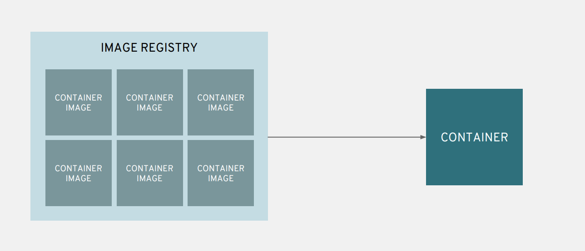

Lab 2 - Container Images and Registries
========================================

The container revolution couldn't have happened without the ability to easily package up what you want in your container and move it from one platform to another. The `OCI Image Format Standard <https://github.com/opencontainers/image-spec>`__ provides us all a standard to package up and transfer containers. Let's take a quick look at how container images work.

Getting started
''''''''''''''''''''''''''''''''''''''''''

When you read the OCI Image spec, it turns out that containers are really just `tarballs <https://whatis.techtarget.com/definition/tarball-tar-archive>`__, or compressed Linux ``tar`` archives. That means we can examine them. Let's do that in this lab.

.. important::

  For this lab, SSH to your control node.

  .. parsed-literal::

    ssh |ssh_command|
    sudo su -

Now, let's start examining the container images on this host.

Examining container caches
'''''''''''''''''''''''''''

Once on the control node, run the ``docker images`` command to see the images on the host's local container cache. There should only be 1 container image; the container image that houses this lab guide.

.. code-block:: shell

  # docker images
  REPOSITORY                                                    TAG                 IMAGE ID            CREATED             SIZE
  quay.io/jduncan/operator-workshop-lab-guide-better-together   latest              dc8e2f6241dd        3 days ago          521 MB

Let's take a look at the ``docker history`` output for our host. Notice all of the layers, the command that creted them, as well as the size of each layer.

.. code-block::

  # docker history quay.io/jduncan/operator-workshop-lab-guide-better-together
  IMAGE               CREATED             CREATED BY                                      SIZE                COMMENT
  dc8e2f6241dd        3 days ago          /bin/sh -c #(nop)  USER 10001                   0 B
  <missing>           3 days ago          |1 workshop_name=better-together /bin/sh -...   5.46 MB
  <missing>           3 days ago          /bin/sh -c #(nop)  LABEL maintainer=jdunca...   0 B
  <missing>           3 days ago          /bin/sh -c #(nop)  CMD ["/opt/docs/entrypo...   0 B
  <missing>           3 days ago          /bin/sh -c #(nop)  EXPOSE 8080                  0 B
  <missing>           3 days ago          |1 workshop_name=better-together /bin/sh -...   76 MB
  <missing>           3 days ago          |1 workshop_name=better-together /bin/sh -...   8.01 MB
  <missing>           3 days ago          /bin/sh -c #(nop) WORKDIR /opt/docs             0 B
  <missing>           3 days ago          /bin/sh -c #(nop) COPY multi:7598b897ed3eb...   5.46 MB
  <missing>           5 days ago          |1 workshop_name=better-together /bin/sh -...   33.1 MB
  <missing>           5 days ago          |1 workshop_name=better-together /bin/sh -...   191 MB
  <missing>           5 days ago          /bin/sh -c #(nop)  ENV APP_DOMAIN=apps.exa...   0 B
  <missing>           5 days ago          /bin/sh -c #(nop)  ENV MASTER_URL=ocp.exam...   0 B
  ...

.. note::

  Container image layers go together in a sort of "layer cake", with each layer depending on all of the layers below it to create a fully functional container from the image. These layers make it quicker to push small changes around inside your container platform.

  .. figure:: images/ops/images_layer_cake.png
    :alt: Container Layer Cake model

    Container "Layer Cake" model

Next, we'll export a container image from the cache into a local file we can examine in-depth.

.. note::

  The content for this lab section is from a more in-depth `blog post <https://medium.com/@jamieeduncan/dissecting-a-docker-container-image-6da2411fcebe>`__ from 2017.

Extracting containers from a host cache
''''''''''''''''''''''''''''''''''''''''

To save a container image from the host cache, use the ``docker save`` command directed into a local file.

::

  # docker save dc8e2f6241dd > lab-guide.tar
  # ll -h lab-guide.tar
  -rw-r--r--. 1 root root 514M Jun  2 19:01 lab-guide.tar

Next, make a directory to hold our image components and extract the image into it. Looking inside the directory, we see a bunch of directories with long names, a `JSON <https://www.json.org/>`__ with the name of the full `SHA256 <https://en.wikipedia.org/wiki/SHA-2>`__ hash of the image, and a file named ``manifest.json``.

::

  # mkdir image
  # tar -xf lab-guide.tar -C image/
  # # ll image/
  total 12
  drwxr-xr-x. 2 root root   50 May 30 17:58 1905aa0cb719c5585ccc6460feeaeb94993bc742d382b58acc5dff28a50c561f
  drwxr-xr-x. 2 root root   50 May 30 17:58 3625409654926a71cd7cd6da40e66ae56942ab59e92e26c97f8be0a7cb9ddec8
  drwxr-xr-x. 2 root root   50 May 30 17:58 41b98d9455bce55d0adbeee9d697651a69ea6c2f8a5d8657d05196a98c36c1f9
  drwxr-xr-x. 2 root root   50 May 30 17:58 5ddf3380f5d38583c77dc1fefbcbba15e2f54f707addabe85a41f159dcb48214
  drwxr-xr-x. 2 root root   50 May 30 17:58 5ed0026c95c65ca424f17e8d92754093cfe22a686a59a9d2056c7692bdff4735
  drwxr-xr-x. 2 root root   50 May 30 17:58 6e5b8439d866c8f60b0bede79cd91ee0971d2d2a064425d176cebafa5afce677
  -rw-r--r--. 1 root root 5545 May 30 17:58 dc8e2f6241dd8b4973552122318af337238926fa7054eb2da784a643fc429a90.json
  drwxr-xr-x. 2 root root   50 May 30 17:58 e5046f7b8b66f8b099a8bd51097a630a73e4344b736d5d4c8c6e6d53a5117997
  -rw-r--r--. 1 root root  651 Dec 31  1969 manifest.json

Next, let's look at these components in more depth.

Container image components
'''''''''''''''''''''''''''

manifest.json
~~~~~~~~~~~~~~~

``manifest.json`` provides an overview of the container ID, each corresponding layer that makes it up, and any tags added to the image.

.. code-block:: json

  [
    {
        "Config": "dc8e2f6241dd8b4973552122318af337238926fa7054eb2da784a643fc429a90.json",
        "Layers": [
            "e5046f7b8b66f8b099a8bd51097a630a73e4344b736d5d4c8c6e6d53a5117997/layer.tar",
            "3625409654926a71cd7cd6da40e66ae56942ab59e92e26c97f8be0a7cb9ddec8/layer.tar",
            "1905aa0cb719c5585ccc6460feeaeb94993bc742d382b58acc5dff28a50c561f/layer.tar",
            "41b98d9455bce55d0adbeee9d697651a69ea6c2f8a5d8657d05196a98c36c1f9/layer.tar",
            "6e5b8439d866c8f60b0bede79cd91ee0971d2d2a064425d176cebafa5afce677/layer.tar",
            "5ed0026c95c65ca424f17e8d92754093cfe22a686a59a9d2056c7692bdff4735/layer.tar",
            "5ddf3380f5d38583c77dc1fefbcbba15e2f54f707addabe85a41f159dcb48214/layer.tar"
        ],
        "RepoTags": null
    }
  ]

<image_id>.json
~~~~~~~~~~~~~~~~

The ``JSON`` file that is named after the full SHA256 hash of the container image contains all of the information about the container image. Default environment variables, architectures, the layer order, and tons of other information that tells the container runtime how to configure containers that use this image.

.. code-block:: json

  {
      "architecture": "amd64",
      "config": {
          "ArgsEscaped": true,
          "AttachStderr": false,
          "AttachStdin": false,
          "AttachStdout": false,
          "Cmd": [
              "/opt/docs/entrypoint.sh"
          ],
          "Domainname": "",
          "Entrypoint": null,
          "Env": [
              "PATH=/usr/local/sbin:/usr/local/bin:/usr/sbin:/usr/bin:/sbin:/bin",
              "WORKSHOP_NAME=better-together",
              "STUDENT_NAME=example student",
              "BASTION_HOST=bastion.example.com",
              "MASTER_URL=ocp.example.com",
              "APP_DOMAIN=apps.example.com"
          ],
          "ExposedPorts": {
              "8080/tcp": {}
          },
          "Hostname": "",
          "Image": "sha256:1357c9270effba2115f7501316a15b0eac797c0a71d3a02e4589974931609dbd",
          "Labels": {
              "maintainer": "jduncan@redhat.com",
              ...
      }
    }
  }

Layer directories
~~~~~~~~~~~~~~~~~~

Each layer directory consists of 3 objects:

- the tar archive that contains the actual filesystem slice for that layer of the container image.
- a ``VERSION`` file that indicates which version of the OCI container image spec this layer complies with
- a file named ``json`` that provides all of the needed information for that layer of the container image

.. code-block:: json

  {
    "container_config": {
        "AttachStderr": false,
        "AttachStdin": false,
        "AttachStdout": false,
        "Cmd": null,
        "Domainname": "",
        "Entrypoint": null,
        "Env": null,
        "Hostname": "",
        "Image": "",
        "Labels": null,
        "OnBuild": null,
        "OpenStdin": false,
        "StdinOnce": false,
        "Tty": false,
        "User": "",
        "Volumes": null,
        "WorkingDir": ""
    },
    "created": "2019-05-30T21:58:38.512048Z",
    "id": "1905aa0cb719c5585ccc6460feeaeb94993bc742d382b58acc5dff28a50c561f",
    "parent": "3625409654926a71cd7cd6da40e66ae56942ab59e92e26c97f8be0a7cb9ddec8"
  }

Using the OCI container image format, you can use these individual layers to minimize the size of the container image cache on any single host. The more layers shared by each running container, the fewer cache layers you need on a given host.

.. note::

  When a container is created, all of the needed image layers are added to the container's mount namespace as read-only files. A copy-on-write fileystem is added to the namespace using `OverlayFS <https://www.kernel.org/doc/Documentation/filesystems/overlayfs.txt>`__. For more information, take a look at the `Graph Drivers <https://developers.redhat.com/blog/2018/02/22/container-terminology-practical-introduction/#h.kvykojph407z>`__ for container runtimes.

Putting the layers togther
'''''''''''''''''''''''''''

This is how container images work. Each image is made up of multiple re-usable layers that contain their own metadata. This metadata provides the container runtime everything it needs to create a container using that image.

Containers on a single host is helpful. But OpenShift is a cluster of container hosts managed as a single platform. To provide container images across multiple hosts efficiently, they need to be housed in a *container registry*. OpenShift provides a registry out of the box. Let's take a look at how registries work to wrap up this lab.

Registries provide a CI/CD target and a source of truth
''''''''''''''''''''''''''''''''''''''''''''''''''''''''

Container registries provide a centralized location to house container images for use across multiple servers, or even multiple clusters. OpenShift deploys a containerized image registry on the infrastructure node of your OpenShift cluster by default. It just works, and we don't really have time today to dig too deep into it.

But we need to mention it, and provide an overview of why registries are essential to a container platform.

  Contain Registry high level operation

.. note::

  The registry OpenShift deploys out of the box has some additional hooks built into it that allow for easy interactions with CI/CD workflows to and from the registry.

  Additionally, `Quay <https://quay.io>`__ provides an enterprise-grade, geo-replicated container registry with security scanning and its own build and version control components.

Summary
'''''''''

In this section we've discussed how container images work, disassembled and analyzed a functional container image, and discussed how container registries make images available at scale for your cluster.
