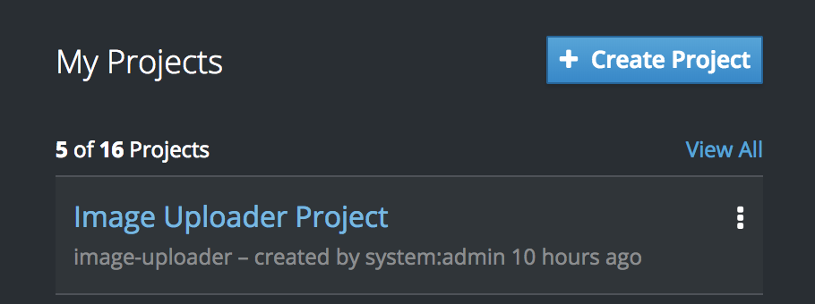
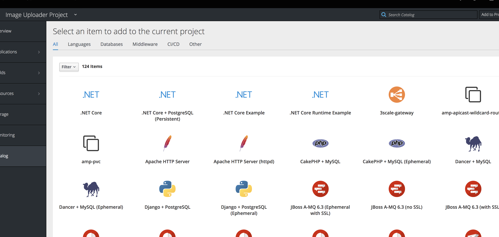
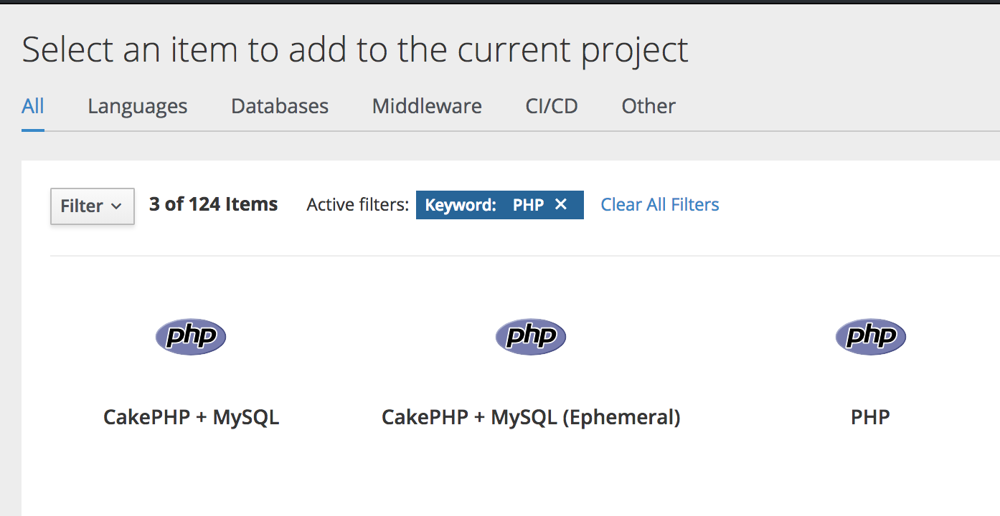
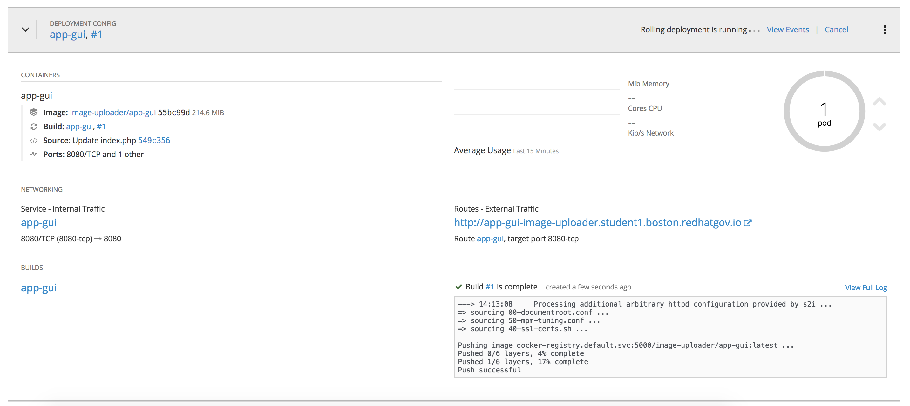

Lab 5 - Applications in OpenShift
==================================

In this section, we'll use both the CLI and web interface to deploy and
examine applications in OpenShift. While this certainly isn't an
Ops-specific domain, it's required knowledge for all OpenShift users.

.. important::

  For this lab, SSH to your master node and escalate to your root user so you can interact with OpenShift via the ``oc`` command line client.

Deploying your first applications
'''''''''''''''''''''''''''''''''''''''''

We'll be using a `sample
application <https://github.com/OpenShiftInAction/image-uploader>`__
which is a simple PHP image uploader application. To build the
application we'll be using `Source-to-image
(S2I) <https://docs.openshift.com/container-platform/3.10/creating_images/s2i.html>`__.
S2I is a workflow built into OpenShift that lets developers specify a
few options along with their source code repository, and a custom
container image is generated.

.. admonition:: A bit about S2I

  S2I uses a developer's source code along with what we refer to as a
  *base image*. An S2I base image is like a normal container base image
  with a little bit of JSON added in. This JSON tells the S2I process
  where to place the application source code so it can be properly served,
  along with any other instructions about requirements to build and
  prepare the application.

  As of right now, S2I expects the source code to be stored on a git
  server or platform like `Github <https://github.com>`__ or
  `Gitlab <https://www.gitlab.com>`__.

Multiple ways to deploy applications
''''''''''''''''''''''''''''''''''''''''''''

There are other ways to deploy applications into OpenShift that we won't
have time to cover today. In short, OpenShift can deploy applications
using just about any container-based workflow you can imagine.

-  External CI/CD workflows that create images that are pushed into the
   OpenShift registry
-  OpenShift with an internal Jenkins server (coming up in section 4.0)
-  Specifying a Dockerfile
-  Just about anything you can think of that builds out a container

Enough talk, let's get an application deployed into OpenShift. First,
we'll use the CLI.

Using the CLI
'''''''''''''''''''''

Let's make double-sure that we're using our ``image-uploader`` project.

::

    # oc project image-uploader

Inside the ``image-uploader`` project you'll use the ``oc new-app``
command to deploy your new application using S2I.

::

    # oc new-app --image-stream=php --code=https://github.com/OpenShiftInAction/image-uploader.git --name=app-cli--> Found image b3deb14 (2 weeks old) in image stream "openshift/php" under tag "7.1" for "php"
        Apache 2.4 with PHP 7.1
        -----------------------
        PHP 7.1 available as container is a base platform for building and running various PHP 7.1 applications and frameworks. PHP is an HTML-embedded scripting language. PHP attempts to make it easy for developers to write dynamically generated web pages. PHP also offers built-in database integration for several commercial and non-commercial database management systems, so writing a database-enabled webpage with PHP is fairly simple. The most common use of PHP coding is probably as a replacement for CGI scripts.

        Tags: builder, php, php71, rh-php71

        * The source repository appears to match: php
        * A source build using source code from https://github.com/OpenShiftInAction/image-uploader.git will be created
          * The resulting image will be pushed to image stream "app-cli:latest"
          * Use 'start-build' to trigger a new build
        * This image will be deployed in deployment config "app-cli"
        * Ports 8080/tcp, 8443/tcp will be load balanced by service "app-cli"
          * Other containers can access this service through the hostname "app-cli"

    --> Creating resources ...
        imagestream "app-cli" created
        buildconfig "app-cli" created
        deploymentconfig "app-cli" created
        service "app-cli" created
    --> Success
        Build scheduled, use 'oc logs -f bc/app-cli' to track its progress.
        Application is not exposed. You can expose services to the outside world by executing one or more of the commands below:
         'oc expose svc/app-cli'
        Run 'oc status' to view your app.

The build process should only take a couple of minutes. Once the output
of ``oc get pods`` shows your app-cli pod in a Ready and Running state,
you're (almost) good to go.

::

    # oc get pods
    NAME              READY     STATUS      RESTARTS   AGE
    app-cli-1-build   0/1       Completed   0          2m
    app-cli-1-tthhf   1/1       Running     0          2m

We talked briefly about services and pods and all of the constructs
inside OpenShift during the presentation part of this lab. You can see
in the output above that you created a service as part of your new
application, along with other needed objects. Let's take a look at the
app-cli service using the command line.

::

  # oc describe svc/app-cli
  Name:              app-cli
  Namespace:         image-uploader
  Labels:            app=app-cli
  Annotations:       openshift.io/generated-by=OpenShiftNewApp
  Selector:          app=app-cli,deploymentconfig=app-cli
  Type:              ClusterIP
  IP:                172.30.251.220
  Port:              8080-tcp  8080/TCP
  TargetPort:        8080/TCP
  Endpoints:         10.130.0.36:8080
  Port:              8443-tcp  8443/TCP
  TargetPort:        8443/TCP
  Endpoints:         10.130.0.36:8443
  Session Affinity:  None
  Events:

Before we can get to our new application, we have to expose the service
externally. When you deploy an application using the CLI, an external
route is not automatically created. To create a route, use the
``oc expose`` command.

::

  # oc expose svc/app-cli route "app-cli" exposed

.. admonition:: What is ``svc``?!

  Because typing is hard, most objects in OpenShift have an abbreviated
  syntax you can use on the CLI. Services can also be described as
  ``svc``, DeploymentConfigs are ``dc``, Replication Controllers are
  ``rc``. Pods and routes don't have abbreviations. A list is available
  `in the OpenShift
  documentation <https://docs.openshift.com/container-platform/3.10/cli_reference/basic_cli_operations.html#object-types>`__.

To see and confirm our route, use the ``oc get routes`` command.

::

  # oc get routes
  NAME      HOST/PORT                                             PATH      SERVICES   PORT       TERMINATION   WILDCARD
  app-cli   app-cli-image-uploader.student1.boston.redhatgov.io             app-cli    8080-tcp                 None

If you browse to your newly created route, you should see the Image
Uploader application, ready for use.

.. figure:: images/ops/app-cli.png
   :alt:

And that's it. Using OpenShift, we took nothing but a github repo and
turned it into a fully deployed application in just a handful of
commands. Next, let's scale your application to make it more resilient
to traffic spikes.

Scaling an application using the CLI
''''''''''''''''''''''''''''''''''''''''''''

Scaling your ``app-cli`` application is accomplished with a single
``oc scale`` command.

::

  # oc scale dc/app-cli --replicas=3 deploymentconfig.apps.openshift.io "app-cli" scaled

Because your second application node doesn't have the custom container
image for ``app-cli`` already cached, it may take a few seconds for the
initial pod to be created on that node. To confirm everything is
running, use the ``oc get pods`` command. The additional ``-o wide``
provides additional output, including the internal IP address of the pod
and the node where it's deployed.

::

  # oc get pods -o wide
  NAME              READY     STATUS      RESTARTS   AGE       IP            NODE
  app-cli-1-26fgz   1/1       Running     0          9s        10.131.0.6    ip-172-16-50-98.ec2.internal
  app-cli-1-bgt75   1/1       Running     0          4m        10.130.0.41   ip-172-16-245-111.ec2.internal
  app-cli-1-build   0/1       Completed   0          21m       10.130.0.34   ip-172-16-245-111.ec2.internal
  app-cli-1-tthhf   1/1       Running     0          21m       10.130.0.36   ip-172-16-245-111.ec2.internal

Using a single command, you just scaled your application from 1 instance
to 3 instances on 2 servers. In a matter of seconds. Compare that to
what your application scaling process is using VMs or bare metal
systems; or even things like Amazon ECS or just Docker. It's pretty
amazing. Next, let's do the same thing using the web interface.

Using the web interface
'''''''''''''''''''''''''''''''

The web interface for OpenShift makes additional assumptions when its
used. The biggest difference you'll notice compared to the CLI is that
routes are automatically created when applications are deployed. This
can be altered, but it is the default behavior. To get started, browse
to your control node using HTTPS and log in using your admin username.

.. figure:: images/ops/ocp_login.png
   :alt:

On the right side, select the Image Uploader Project. You may need to
click the *View All* link to have it show up for the first time.

After clicking on the project, you'll notice the app-cli project we just
deployed. If you click on its area, it will expand to show additional
application details. These details include the exposed route, build
information, and even resource metrics.

.. figure:: images/ops/app-cli_gui.png
   :alt:

To deploy an application from the web interface, click the *Add To
Project* button in the top right corner, followed by *Browse Catalog*.

.. figure:: images/ops/ocp_add_to_project.png
   :alt:

This button brings up the Template Catalog. The Template Catalog is a
collection of 100+ builder images and quickstart templates that
developers can use out of the box to deploy custom applications quickly.

.. admonition:: What about my custom apps and stuff?

  The templates available in today's lab are just what's available out
  of the box in OpenShift. You and your developers can also `create custom
  templates <https://docs.openshift.com/container-platform/3.10/dev_guide/templates.html>`__
  and add them to a single project or make them avaialable to your entire
  cluster. Other platforms can also be integrated into your OpenShift
  Catalog. Ansible (which is being used by your developers in the
  developer lab right now!), AWS, Azure, and other service brokers are
  available for integration with OpenShift today.

Using the *Search Catalog* form, search for *PHP*, because the Image
Uploader application is written using PHP. You'll get 3 search results
back.

Image Uploader is a simple application that doesn't require a database
or CMS. So we'll just select the PHP builder image, which is the same
image we used when we deployed the same application from the command
line. Selecting this option takes you to a simple wizard that helps
deploy your application. Supply the same git repository you used for
``app-cli``, give it the name ``app-gui``, and click *Create*.

.. figure:: images/ops/ocp_app-gui_wizard.png
   :alt:

You'll get a confirmation that the build has started. Click the
*Continue to project overview* link to return to the Image Uploader
project. You'll notice that the ``app-gui`` build is progressing
quickly.

Summary
'''''''''

After the build completes, the deployment of the custom container image
starts and quickly completes. A route is then created and automatically
associated with ``app-gui``. And just like that, you've deployed
multiple instances of the same application with different URLs onto your
OpenShift platform.

Next, let's take a quick look at what is going on with your newly
deployed applications within the OpenShift cluster.
