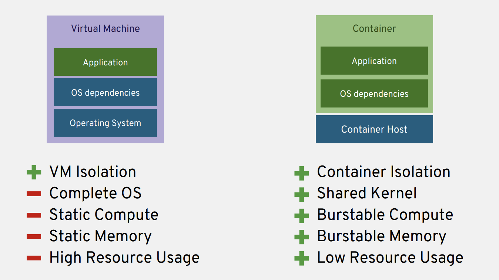

Discussion - Container Fundamentals
====================================

In this section we'll discuss the fundamental components that make up
OpenShift. Any Ops-centric discussion of an application platform like
OpenShift needs to start with containers; both technically and from a
perspective of value. We'll start off talking about why containers are
the best solution today to deliver your applications.

.. note::
  For more in depth information on this topic, please take a look at the `OpenShift Technical
  Overview <https://s3.amazonaws.com/openshift-ansible-workshop-materials/openshift_technical_overview.pdf>`__.

What exacty *is* a container?
'''''''''''''''''''''''''''''''''''''

There are t-shirts out there say "Containers are Linux". Well. They're
not wrong. The components that isolate and protect applications running
in containers are unique to the Linux kernel. Some of them have been
around for years, or even decades. In this section we'll investigate
them in more depth.

Comparing VM and Container resource usage
'''''''''''''''''''''''''''''''''''''''''''''''''

In this section we're going to investigate how containers use your
datacenter resources more efficiently.



  Container host resources compared to VM hypervisor resources

First, we'll focus on storage.

Storage resource consumption
`````````````````````````````

Compared to a 40GB disk image, the RHEL 7 container base image is
`approximately
72MB <https://access.redhat.com/containers/?tab=overview#/registry.access.redhat.com/rhel7>`__.
It's a widely accepted rule of thumb that container images shouldn't
exceed 1GB in size. If your application takes more than 1GB of code and
libraries to run, you likely need to re-think your plan of attack.

Instead of each new instance of an application consuming 40GB+ on your
storage resources, they consume a couple hundred MegaBytes. Your next
storage purchase just got a whole lot more interesting.

CPU and RAM resource consumption
`````````````````````````````````

It's not just storage where containers help save resources. We'll
analyze this in more depth in the next section, but we want to get the
idea into your head for that part of our investigation now. Containers
are smaller than a full VM because containers don't each run their own
Linux kernel. All containers on a host share a single kernel. That means
a container just needs the application it needs to execute and its
dependencies. You can think of containers as a "portable userspace" for
your applications.

Because each container doesn't require its own kernel, we also measure
startup time in milliseconds! This gives us a whole new way to think
about scalability and High Availability!

.. figure:: images/ops/metrics.jpeg
   :alt: Metrics resource consumption

   The registry-console application consumes less than 3MB of RAM!

If we were deploying this application in a VM we would spend multiple
gigabytes of our RAM just so we could give the application the handful
of MegaBytes it needs to run properly.

.. note::

  Think about your traditional virtualization platform, or your workflow
  to deploy instances to your public cloud of choice for a moment. How big
  is your default VMDK for your root OS disk? How much extra storage do
  you add to your EC2 instance, just to handle the 'unknown' situations?
  Is it 40GB? 60GB?

  **This phenomenon is known as *Worst Case Scenario Provisioning*.** In
  the industry, we've done it for years because we consider each VM a
  unique creature that is hard to alter once created. Even with more
  optimized workflows in the public cloud, we hold on to IP addresses, and
  their associated resources, as if they're immutable once created. It's
  easier to overspend on compute resources for most of us than to change
  an IP address in our IPAM once we've deployed a system.

The same is true for CPU consumption. In OpenShift, we measure and
allocate CPUs by the *millicore*, or thousandth of a core. Instead of
multiple CPUs, applications can be given the small fractions of a CPU
they need to get their job done.

Containers are an evolution, not an end state
''''''''''''''''''''''''''''''''''''''''''''''

At their heart, containers are the next evolution in how we isolate
processes on a Linux system. This evolution started when we created the
first computers. They evolved from ENIAC, through mainframes, into the
server revolution all the way through virtual machines (VMs) and now
into containers.

.. figure:: images/ops/evolution.png

More efficient application isolation (we'll get into how that works in
the next section) provides an Ops team a few key advantages that we'll
discuss next.

Summary
'''''''''''''''

Containers aren't just a tool to help developers create applications
more quickly. Although they are revolutionary in how they do that.
Containers aren't just marketing hype. Although there's certainly a lot of
that going on right now, too.

For an Ops team, containers take any application and deploy it more
efficiently in our infrastructure. Instead of measuring each application
in GB used and full CPUs allocated, we measure containers using MB of
storage and RAM and we allocate thousandths of CPUs.

OpenShift deployed into your existing datacenter gives you back
resources. For customers deep into their transformation with OpenShift,
an exponential increase in resource density isn't uncommon.
